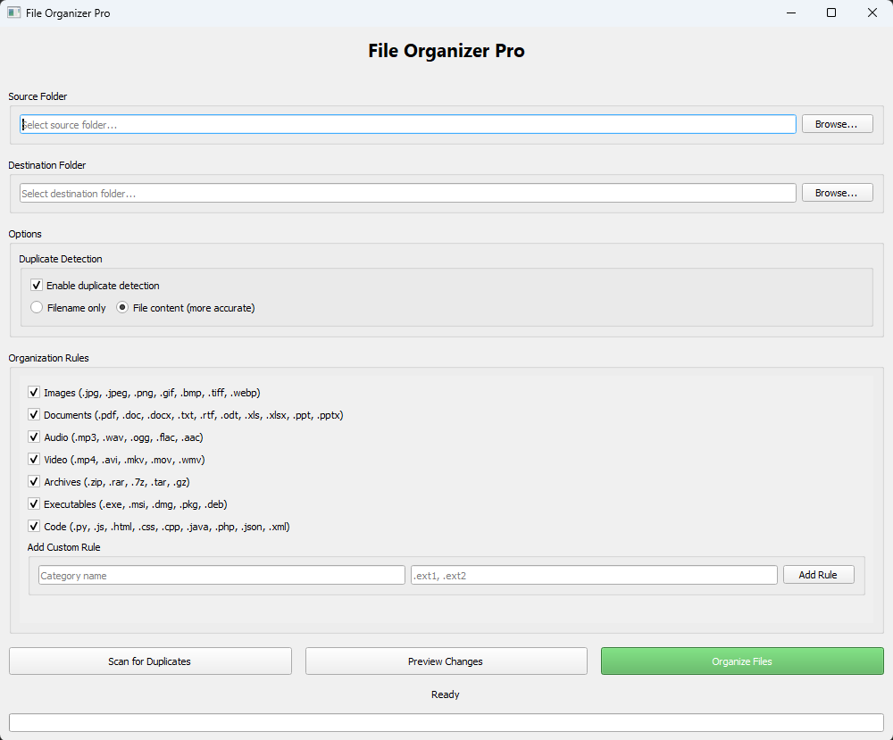

# File Organizer Pro with Multi-Threaded Duplicate Detection
<p align="left">
    
    
    
</p>

A professional, cross-platform desktop application built with Python and PyQt5 designed for **efficient file management** and **accurate duplicate removal**.

---

### Key Features & Technical Highlights

This application is built to demonstrate strong **Object-Oriented Design (OOP)** and efficient resource management.

#### File Organization & Cleanup

* **Intelligent Sorting:** Automatically categorizes and moves files (Images, Documents, Archives, Code, etc.) into designated folders.
* **Custom Rule Editor:** Users can easily **add custom file type rules** (categories and extensions) directly through the GUI.
* **Safe Execution:** Utilize the **Preview Mode** to review all proposed file moves before executing the organization process.

#### Multi-Threaded Duplicate Management

* **Background Processing:** Utilizes **PyQt5 QThreads** to run file scanning and organization tasks in the background, ensuring the GUI remains responsive and avoids freezing.
* **Accurate Hashing:** Detects duplicates by comparing **MD5 content hashes**, providing highly accurate identification regardless of filename.
* **Flexible Scanning:** Supports duplicate detection based on **Filename** or **File Content**.
* **Dedicated Duplicates Manager:** Provides a separate window to review duplicate groups, select files, and safely delete unwanted copies.

#### User Interface & Experience

* **Modern GUI:** A polished, intuitive interface designed with a custom QSS theme for PyQt5.
* **Dynamic Theming:** Includes support for both Light and Dark Modes using QPalette.
* **Real-Time Feedback:** Features a progress bar and status labels for monitoring long-running operations.

---

### Application View



A view of the main organization rules, source/destination selectors, and action buttons.

---

### Installation & Running the Application

#### Prerequisites

* Python 3.7+
* The `pip` package manager

#### Setup Steps

1.  **Clone the Repository:**
    ```bash
    git clone [https://github.com/MrRajiii/file-organizer.git](https://github.com/MrRajiii/file-organizer.git)
    cd file-organizer
    ```

2.  **Install Dependencies:**
    ```bash
    pip install PyQt5
    ```

3.  **Run the Application:**
    ```bash
    python file_organizer.py
    ```

#### Usage Guide

1.  **Select Folders:** Use the "Browse" buttons to specify the **Source** and **Destination** directories.
2.  **Set Rules:** Toggle the built-in organization rules or use the **"Add Custom Rule"** section to define new categories.
3.  **Scan:** Click **"Scan for Duplicates"** to identify redundant files using the chosen method (Filename or Content).
4.  **Execute:** Use **"Preview Changes"** for a dry run, then click **"🚀 Organize Files"** to move the files according to the active rules.

---

### Code Structure & Engineering (Updated)

This project is structured around key OOP principles with a clear separation of concerns (Model-View-Service):

* **`FileOrganizerApp` (QMainWindow):** The main **Controller/View** layer. Handles all UI initialization, user interaction, and delegates complex tasks to threads.
* **`FileService` (Standard Class):** The **Service/Model** layer. Contains all pure business logic, file system operations (hashing, finding duplicates, moving files), completely decoupled from the UI.
* **`ScanThread` / `OrganizeThread` (QThread):** Dedicated worker threads responsible for computationally heavy tasks, communicating progress via PyQt5 signals.
* **`DuplicateWindow` (QMainWindow):** A dedicated class for managing the UI and logic for the duplicate files review.
* **Signals & Slots:** Used extensively to communicate progress and results from the background threads back to the main GUI.

---

### 🤝 Support & Next Steps

If you find this project useful, please give it a star ⭐️. Feel free to open issues for bugs or feature suggestions!
